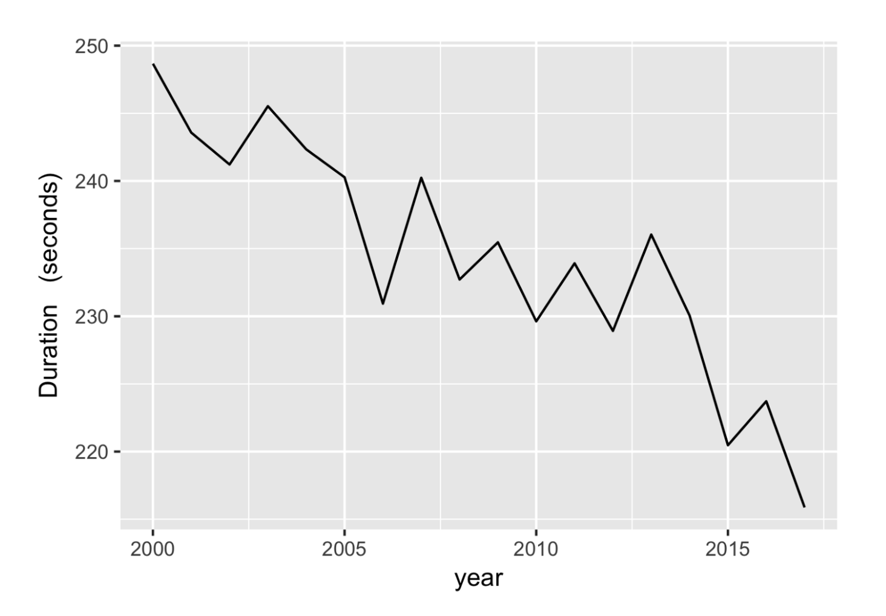
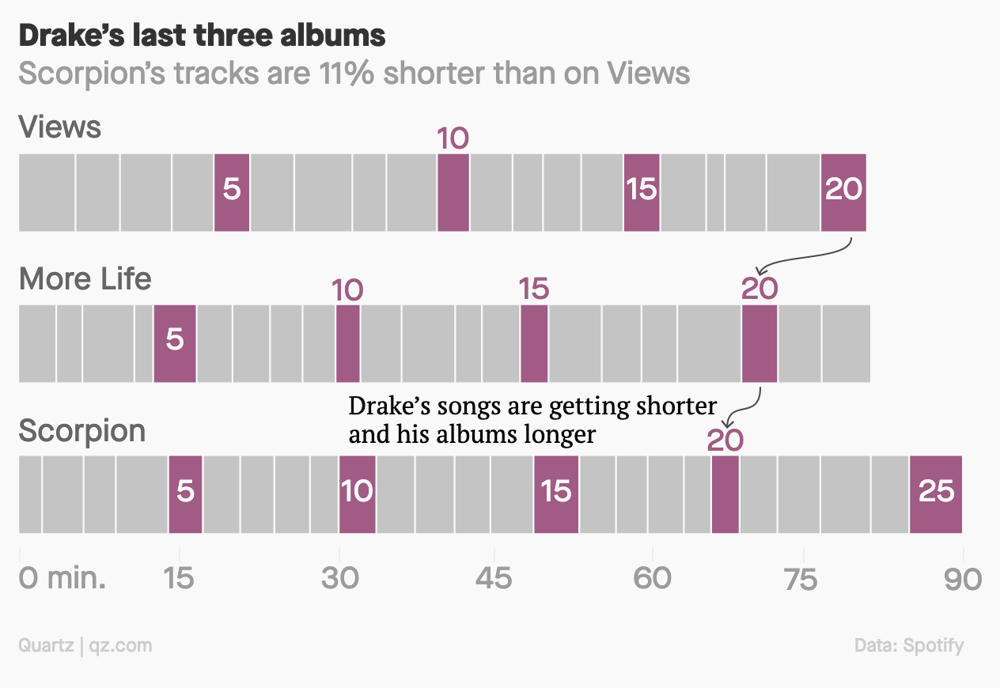

# Telling Stories with Data Final Pt II

## Wireframe 

### Intro
Technology has disrupted the entertainment industry in many ways. We have endless content at our fingertips, all packaged in a user-friendly format: streaming. With the removal of physical limitations and a new method of monetization, streaming is influencing not just end-user listening habits, but the whole structure of popular music. 

### Background
The paid subscription model of streaming began rising to prominence in the mid-2000s, with Spotify debuting in 2008. This format now generates the majority share of revenue in the recorded music industry. 
Visualization here is a stacked bar chart of music industry revenues by format. I'm having trouble getting the data to download on this to create my own visualization at the moment, but it's coming from this dashboard from the RIAA embedded below. I will simplify the categories (vinyl, cassette, CD, digital sale, streaming) in my analysis. 

<iframe src="https://public.tableau.com/views/U_S_RecordedMusicRevenuesbyFormat_0/RevenuesbyFormat?:showVizHome=no&:embed=true" width="100%" height="800" seamless frameborder="0" scrolling="yes"></iframe>

And the volume of album sales (both physical and digital) are dropping each year. 

[Data](https://www-statista-com.cmu.idm.oclc.org/statistics/273308/music-album-sales-in-the-us/)

While paid subscription continues to grow. 

[Data](https://www-statista-com.cmu.idm.oclc.org/statistics/293749/spotify-pandora-number-active-users/)

With this major shift from a sales-based model to a subscription-based model, the way musicians are able to make money off their songs has changed. Spotify [counts a stream](https://artists.spotify.com/faq/stats#how-are-streams-counted) when a listener plays a song for more than 30 seconds. When a stream is counted, the artist makes money. Because of this monetization system, this means that a 5-minute long song is worth the same amount as a 2-minute long song.  
 

Despite the rising streaming revenues and subscriber growth, this new model is less profitable for the end artist. [Sources Estimate](https://www.businessinsider.com/how-much-does-spotify-pay-per-stream) that Spotify pays between $0.003 and $0.005 per stream, so it takes about 250 streams to make a dollar. Furthermore, Spotify takes about a 30% royalty, and after that the publisher, label, agents all take a cut before it reaches the artist. 

### Trends
And so, this new model of monetization has resulted in some interesting trends in the industry. 

We will be specifically analyzing popular music, defined as songs that have had success on the Billboard Hot 100, to reflect music that is more commercialized. 

Because a song that is 5min long is worth the same as 2min long, we've seen a shift in the length in popular songs. 
(currently working to recreate this first chart)

[Data](https://www.billboard.com/articles/columns/chart-beat/8514407/hot-100-top-10s-30-seconds-shorter-2019)

We can also see this trend across albums as well. I will be recreating this infographic (with a few updates, to include album year and average track length). 

We are no longer constrained by physical limitations, so albums may get longer and longer just stuffed with shorter tracks. 
Visualization of time limit for physical formats (vinyl, cassette, CD vs. unlimited for digital) 

Trend is likely to continue, with the impact of Tik Tok and videos being constrained to one minute.

### CTA 
As a music industry professional, it's all about earworms and hooks and brevity to monetize.  

As a casual music listener or buyer, if you want to support your favorite artists listen to all their songs for 30s at a time lol. Or in addition to your streaming consumption, which doesn't bring in that much money, support with merchandise and concert tickets. 

Additional Reading Links will go here. 

## User Research Protocol 

### Interview Questions
1. Was this clear and easy to understand?
2. Did you feel engaged?
3. Did the use of data and visualizations support the presentation?
4. Do you understand what each graph is trying to convey?
5. Is there a clear call to action or next step?
6. Is there anything else you would've liked to learn?

### Interviewees  
I interviewed a mix of casual music fans and aspiring music professionals to capture both your average listener and your insider with industry expertise. 

### Changes and Quotes
In general, everyone found the story clear and logical to understand! Feedback mainly pertained to ways to make the visualizations clearer, since the story and topic came across really well. 

* "I had a hard time with the Apple and Spotify increase because I wasn't sure which was which between the blue and green lines." *Actionable Rec: Label lines.
* "I loved the first chart where I could interact with the data." *Actionable Rec: When recreating the RIAA chart, allow for lots of user interaction still. 
* "I liked that you used one artist as an example to exemplify the trend." *Actionable Rec: The Drake chart was effective, and I could probably add one more example as well. 
* "I think the trend chart (for the average song duration) can use a different color than black for trend line, and maybe don't have all the gridlines." *Actionable Rec: Introduce color into that chart, add a callout for the debut of Spotify in 2008, remove gridlines. 
* "The Drake one was unclear at first but then I realized that the squares were songs and the whole thing was an album." *Add some additional context to chart. 
* "The CTA is for artists to maximize their profits by producing more shorter songs, and for the listeners to realize how much of the song they listen to actually contributes to profit and support their faves in other ways like merch and concerts."
* "I wonder if there are other platforms that support my favorite artists better but still allow me to have the convenience of streaming?" *I'm fairly certain Bandcamp is a pioneer in this realm. I can add links to articles about that and suggest streaming on Bandcamp. 

### Class Feedback
* Use a stacked area chart for share of songs under 2:30, and divide into <2:30, 2:30-4:00, >4:00 
* Really love the album length visualizations 
* Add depth to why artists are pursuing monetization on Spotify so heavily - it's because the profits are small. This will link it to a better call to action because then it can be how to best support your favorite artists. 
