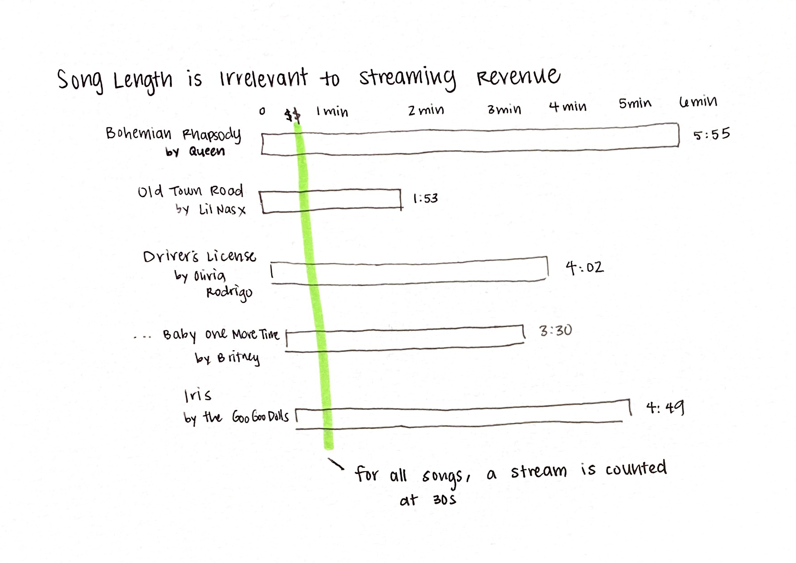

# Telling Stories with Data Final Pt II

## Wireframe 

### Intro
Technology has disrupted the entertainment industry in many ways. We have endless content at our fingertips, all packaged in a user-friendly format: streaming. With the removal of physical limitations and a new method of monetization, streaming is influencing not just end-user listening habits, but the whole structure of popular music. 

### Background
The paid subscription model of streaming began rising to prominence in the mid-2000s, with Spotify debuting in 2008. This format now generates the majority share of revenue in the recorded music industry. 
Visualization here is a stacked bar chart of music industry revenues by format. I'm having trouble getting the data to download on this but it's coming from this dashboard from the RIAA embedded below. I will simplify the categories (vinyl, cassette, CD, digital sale, streaming) in my analysis. 

<ifrrame
src="https://public.tableau.com/views/U_S_RecordedMusicRevenuesbyFormat_0/RevenuesbyFormat?:showVizHome=no&:embed=true" width="90%" height="500" seamless frameborder="0" scrolling="no"></iframe>

And the volume of album sales (both physical and digital) are dropping each year. 

[Data](https://www-statista-com.cmu.idm.oclc.org/statistics/273308/music-album-sales-in-the-us/)

While paid subscription continues to grow. 

[Data](https://www-statista-com.cmu.idm.oclc.org/statistics/293749/spotify-pandora-number-active-users/)

With this major shift from a sales-based model to a subscription-based model, the way musicians are able to make money off their songs has changed. Spotify [counts a stream](https://artists.spotify.com/faq/stats#how-are-streams-counted) when a listener plays a song for more than 30 seconds. When a stream is counted, the artist makes money. Because of this monetization system, this means that a 5-minute long song is worth the same amount as a 2-minute long song.  
 

Despite the rising streaming revenues and subscriber growth, this new model is less profitable for the end artist. [Sources Estimate](https://www.businessinsider.com/how-much-does-spotify-pay-per-stream) that Spotify pays between $0.003 and $0.005 per stream, so it takes about 250 streams to make a dollar. Furthermore, Spotify takes about a 30% royalty, and after that the publisher, label, agents all take a cut before it reaches the artist. 

### Trends
And so, this new model of monetization has resulted in some interesting trends in the industry. 

We will be specifically analyzing popular music, defined as songs that have had success on the Billboard Hot 100, to reflect music that is more commercialized. 

Because a song that is 5min long is worth the same as 2min long, we've seen a shift in song length in popular songs. 
* Visualization of the average length of a song on the Billboard Hot 100 per calendar year
* Visualization of the share of songs under 2:30 

We can also see this trend across albums as well. 
* Refer to Quartz illustration 

We are no longer constrained by physical limitations, so albums may get longer and longer just stuffed with shorter tracks. Point to Drake playlist example. 
* Visualization of time limit for physical formats (vinyl, cassette, CD vs. unlimited for digital) 

We can even see this trend in song structure, where popular songs disrupt the intro-verse-chorus-verse-chorus-bridge-chorus format to begin with a chorus to hook listeners quicker in those first 30s. 

Trend is likely to continue, with the impact of Tik Tok and videos being constrained to one minute. (Find something to illustarte how Tik Tok has impacted the Hot 100? Idk) 

### CTA 
As a music industry professional, it's all about earworms and hooks and brevity. 

As a casual music listener or buyer, if you want to support your favorite artists listen to all their songs for 30s at a time lol. Or in addition to your streaming consumption, which doesn't bring in that much money, support with merchandise and concert tickets. 

Offer resources for additional reading such as NYT, Switched on Pop, other data idk. 

## User Research Protocol 

### Interview Questions
1. Was this clear and easy to understand?
2. Did you feel engaged?
3. Did the use of data and visualizations support the presentation?
4. Do you understand what each graph is trying to convey?
5. Is there a clear call to action or next step?
6. Is there anything else you would've liked tl ear

### Interviewees 
One aspiring music professional
One casual music streamer 
One casual music streamer and vinyl buyer 

### Changes and Quotes

### Class Feedback
* Use a stacked area chart for share of songs under 2:30, and divide into <2:30, 2:30-4:00, >4:00 
* Really love the album length visualizations 
* Add depth to why artists are pursuing monetization on Spotify so heavily - it's because the profits are small. This will link it to a better call to action because then it can be how to best support your favorite artists. 
